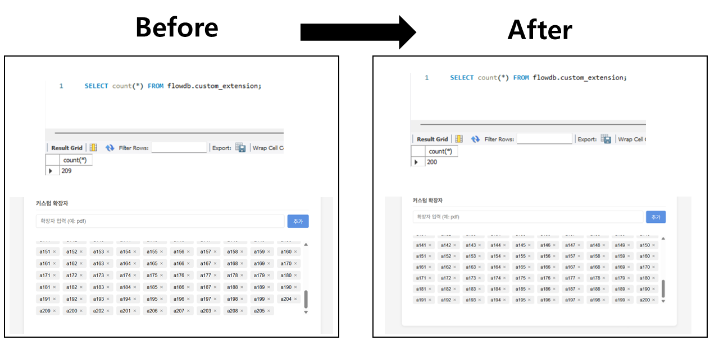
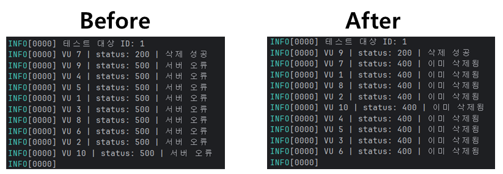
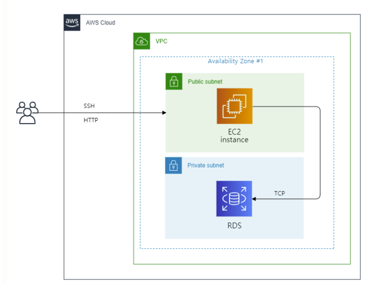

# 파일 확장자 차단 서비스

파일 업로드 시 특정 확장자를 차단하는 관리 페이지입니다.

## 배포 주소

http://98.90.201.238:8080

## 기술 스택

| 분류 | 기술                                    |
|------|---------------------------------------|
| Backend | Java 17, Spring Boot, Spring Data JPA |
| Database | MySQL (AWS RDS)                       |
| Frontend | jQuery                                |
| Infra | AWS EC2, Docker, GitHub Actions CI/CD |
| API 문서 | Springdoc OpenAPI                     |

## 주요 기능

**고정 확장자**
- bat, cmd, com, exe, php, sh, zip 7종 기본 제공
- 체크박스로 차단 여부 토글
- 추가·삭제 불가, 차단 여부만 변경 가능

**커스텀 확장자**
- 추가·삭제 가능
- 최대 200개 제한
- 영문자·숫자 조합만 허용 (한글, 특수문자 불가)
- 숫자만으로 이루어진 이름 불가
- 최대 20자
- 대소문자 구분 (AA와 aa는 별개로 취급)

## 제약 사항

| 제약 | 내용 |
|------|------|
| 커스텀 확장자 최대 개수 | 200개 초과 추가 불가 |
| 입력 형식 | 영문자·숫자 조합만 허용, 최대 20자 |
| 숫자 전용 이름 | 숫자만으로 이루어진 확장자명 불가 |
| 커스텀 중복 | 동일한 이름의 커스텀 확장자 중복 추가 불가 |
| 고정·커스텀 중복 | 고정 확장자와 동일한 이름의 커스텀 확장자 추가 불가 |
| 대소문자 구분 | AA와 aa는 서로 다른 확장자로 처리 |
| 고정 확장자 수정 | 차단 여부 토글만 가능, 추가·삭제 불가 |

## 기술적 고려 사항

### 동시성 제어 (Race Condition)
커스텀 확장자 200개 제한에서 동시 요청 시 초과 등록되는 문제를 발견했습니다.
k6 부하 테스트로 문제를 재현하고 비관적 락(PESSIMISTIC_WRITE)을 적용해 해결했습니다.



### 중복 삭제 방지
동일 항목을 동시에 삭제할 때 존재하지 않는 ID 조회로 500 에러가 발생하는 문제를 JPQL DELETE 쿼리의 반환값으로 처리해 해결했습니다.



### 대소문자 구분
MySQL 기본 Collation(utf8mb4_0900_ai_ci)은 대소문자를 구분하지 않아 AA와 aa가 중복으로 처리되는 문제가 있었습니다. `utf8mb4_bin` Collation을 컬럼에 적용해 해결했습니다.

## 인프라 아키텍처



## CI/CD

main 브랜치에 push 시 GitHub Actions가 자동으로 빌드 및 배포합니다.

```
GitHub push → Gradle 빌드 → Docker 이미지 빌드 → Docker Hub push → EC2 배포
```

## 로컬 실행

```bash
# src/main/resources/application.yml 생성 후
./gradlew bootRun
```

```yaml
# application.yml
spring:
  datasource:
    url: jdbc:mysql://localhost:3306/flowdb?useSSL=false&serverTimezone=Asia/Seoul&allowPublicKeyRetrieval=true
    driver-class-name: com.mysql.cj.jdbc.Driver
    username: root
    password: 1234
  jpa:
    database-platform: org.hibernate.dialect.MySQLDialect
    hibernate:
      ddl-auto: update
    show-sql: true

springdoc:
  swagger-ui:
    path: /swagger-ui.html
  api-docs:
    path: /api-docs
```

## API 문서

http://98.90.201.238:8080/swagger-ui.html
